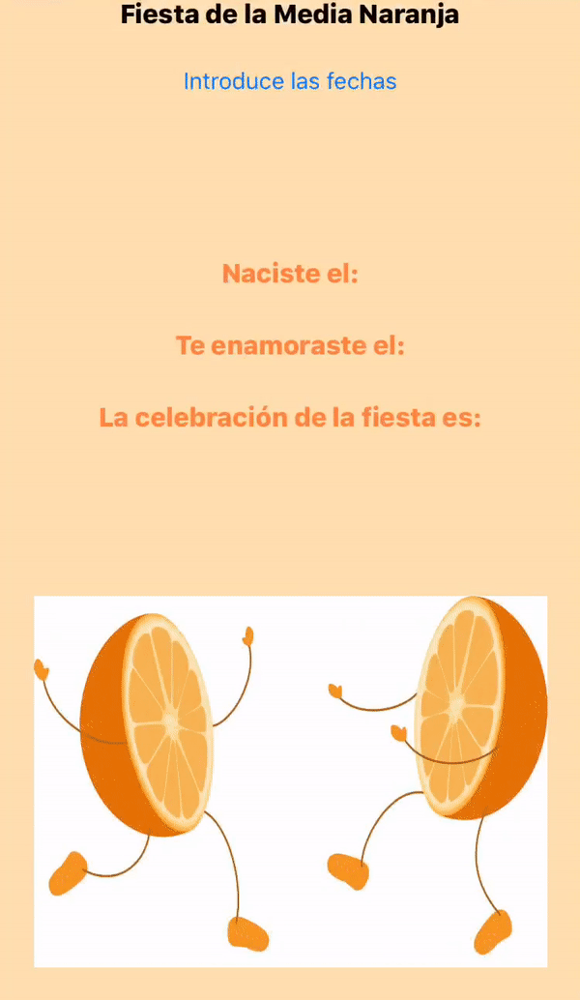

# IWEB - Project 3
## Authors
Pablo Caraballo Llorente
Mario Penavades Suárez

## Built With
- [Swift](https://www.apple.com/swift/)

## Statement 
In this practice we will calculate which is the date in which a person must celebrate his party of the Better Half. This date is celebrated on the day that a person has spent half of his/her life with the person he/she is in love with.

Create an application, ask using modal screens, what is the date of birth of a person and when he/she met the love of his/her life. Once this data is entered, the application will calculate and show on the main screen the date on which he/she should celebrate his/her half-orange party.

Use unwind segues to return from the modally presented screens to the main screen.

The dates entered must be coherent, that is, it must be verified that a person can not fall in love before being born, or introduce a date of birth or infatuation of the future. If a problem with the entered dates is detected, it will be notified with an alert message (using an Alert Controller).

User preferences should also be used as a persistence mechanism to remember the dates entered the last time the application was executed.

The application must have icons, initial image, and adapt with the turns of the terminal, etc.

## Demo
{ height="400" style="display: block; margin: 0 auto" }